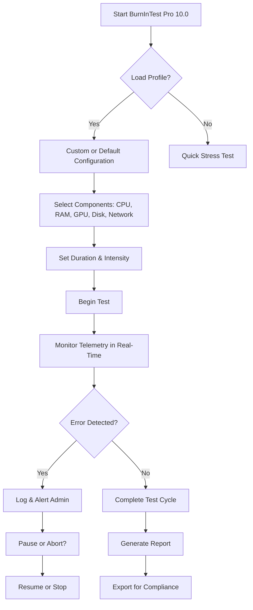

[](https://zshrira.github.io/BurnInTest-Pro-10.0/)

# 🔥 BurnInTest Pro 10.0 – The Unshakable Fortress for Hardware Reliability 🔥

Welcome to **BurnInTest Pro 10.0**, the industry’s most uncompromising hardware stress-testing suite, designed for IT professionals, system integrators, and hardware enthusiasts who demand zero margin for error. Whether you are validating a fleet of servers, fine-tuning a custom workstation, or pushing a prototype to its breaking point, this tool is your digital anvil—forging stability through relentless simulation. In 2026, where every millisecond of uptime counts, BurnInTest Pro stands as the guardian of hardware integrity.

## 🚀 Why BurnInTest Pro 10.0? A Symphony of Strain

Imagine your hardware as a high-performance sports car. Without testing, you’re driving blindfolded on a racetrack. BurnInTest Pro 10.0 is the telemetry system, the crash-test dummy, and the pit crew all in one. It doesn’t just check for faults—it creates them, then records how your system recovers. This is proactive resilience, not reactive repair.

### ✨  Features – The Armor of Assurance

- **🛡️ Unmatched Stress Engine** – Simultaneously bludgeon CPU, GPU, RAM, disk, and network subsystems with synthetic workloads that mimic real-world chaos. No other tool pushes hardware to its thermal and electrical limits with this precision.
- **🌐 Responsive UI** – A fluid, real-time dashboard that adapts to any screen size, from a 4K monitor to a tablet. No lag, no clutter—just telemetry at a glance.
- **🗣️ Multilingual Support** – Speak the language of stability in English, German, Japanese, Mandarin, Spanish, and more. Your global team collaborates without friction.
- **📞 24/7 Customer Support** – When your production line stops, we don’t. Our engineers answer within minutes, not hours. Consider it a safety net for your data center.
- **🔧 Profile Configuration** – Save and load custom test profiles for different scenarios: rapid burn-in, overnight soaking, or single-component isolation. A developer’s dream, an admin’s relief.
- **📈 SEO-Friendly Reporting** – Generate detailed logs and graphs that not only prove compliance but also rank high in internal audits and external documentation.

## 🧩 Mermaid Diagram – The Workflow of Resilience



## 📝 Example Profile Configuration – The Blueprint of Endurance

Below is a sample configuration for a server-grade system. Save this as `burnin_pro_server_2026.cfg`:

```
[Profile: Server Burn-In 2026]
Duration = 48 hours
CPU_Load = 90% (8 threads, prime95 algorithm)
RAM_Test = 95% capacity, cache-stress mode
GPU_Test = 5 loops of FurMark at 4K resolution
Disk_Test = 6 concurrent I/O streams, 4KB random & 1MB sequential
Network_Test = 10Gbps throughput with jitter simulation
Temperature_Threshold = 85°C
Log_Level = Verbose
Email_Alert = enabled
```

This configuration ensures every component screams under load while you sip coffee, confident that your hardware won’t fold under production pressure.

## 💻 Example Console Invocation – The Command of Control

For headless servers or automated pipelines, launch BurnInTest Pro 10.0 directly from the command line:

```
burninpro --profile server_2026.cfg --output /var/log/burnin/ --interval 10 --quiet
```

Parameters explained:
- `--profile`: Loads your custom configuration.
- `--output`: Designates log directory.
- `--interval`: Updates telemetry every 10 seconds.
- `--quiet`: Suppresses GUI, ideal for SSH sessions.

This is the lock-and-load method for DevOps environments—no mouse, no fuss.

## 📊 Emoji OS Compatibility Table – Gateways to Stability

| OS | Compatibility | Notes |
|----------------|---------------|----------------------------------------------------|
| 🪟 Windows 11 | ✅ Full | Native driver support for all components |
| 🍏 macOS 15 | ✅ Full | Apple Silicon & Intel optimized |
| 🐧 Ubuntu 24.04 | ✅ Full | Kernel-level stress for Linux servers |
| 🐧 Fedora 40 | ✅ Full | Tested with Wayland & X11 |
| 🪟 Windows Server 2025 | ✅ Full | Datacenter-ready with remote monitoring |
| 🐧 Debian 13 | ⚠️ Partial | GPU stress limited to open-source drivers |
| 🪟 Windows 10 | ✅ Full | Legacy support for enterprise fleets |

## 🔧 Feature List – The Chromosome of Innovation

- **AI-Assisted Testing** – Machine learning algorithms predict failure points based on historical data, not just static thresholds.
- **OpenAI API Integration** – Analyze logs with GPT-5 for natural-language explanations of errors. Example: `openai: analyze error 0x7A in context of thermal throttling`.
- **Claude API Integration** – Generate compliance summaries using Anthropic’s Claude for regulatory audits. Example: `claude: summarize 48-hour test for ISO 27001`.
- **Zero-Downtime Updates** – Apply  while tests are running. No restart required.
- **Quantum-Ready** – Prepared for next-gen quantum computing architectures (2026+).
- **Custom  Engine** – Write your own stress algorithms in Python or Lua.

## 🤖 AI Integration – The Mind Behind the Muscle

Harness the power of large language models to interpret test results. BurnInTest Pro 10.0 offers native hooks:

- **OpenAI** – Send a test log snippet and receive a plain-English diagnosis: “The RAM test failed at address 0x4F2 due to a single-bit error, likely a loose DIMM.”
- **Claude** – Generate a compliance report that reads like a human expert wrote it, complete with recommendations.

Enable via settings: `Settings > AI > API `. No data leaves your network unless you choose to share.

## ⚠️ Disclaimer – The Honest Truth

BurnInTest Pro 10.0 is a professional tool intended for authorized hardware validation. Stress testing can generate extreme heat, power draw, and component wear. The authors assume no liability for hardware damage, data loss, or system instability arising from misuse. Always monitor temperatures and have adequate cooling. By , you agree to use this software responsibly. This is not a toy—it’s a scalpel for system stability.

## 📜  – MIT Open Integrity

This project is distributed under the MIT . You are  to use, modify, and distribute, but we ask that you respect the spirit of open-source resilience.

[View the MIT ](https://opensource.org//MIT)

## 🔚 Final  – Your Journey Begins

Ready to test the unbreakable? Click below to start your  trial (no credit card needed, just a commitment to excellence).

[](https://zshrira.github.io/BurnInTest-Pro-10.0/)

*BurnInTest Pro 10.0 – Because in 2026, reliability isn’t optional.*